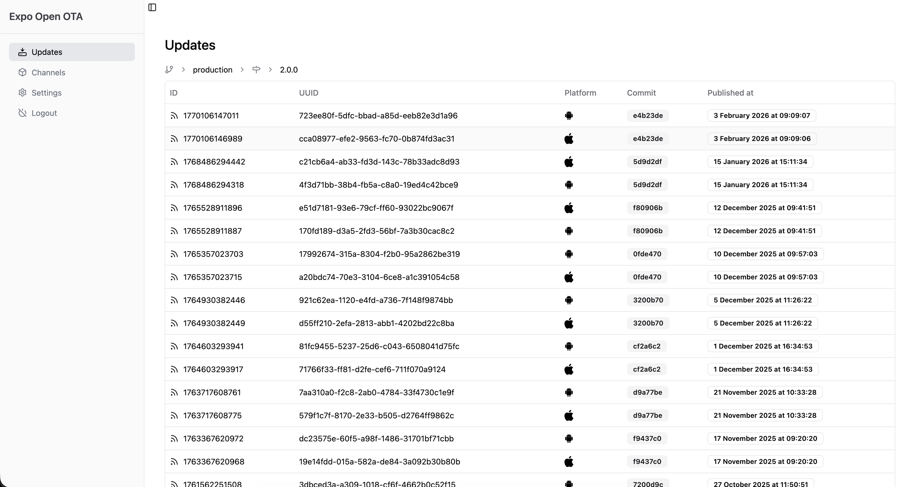

  
  

<h3 align="center">Self-hosted OTA updates for Expo — multi-cloud, production-ready.</h3>

  An open-source Go server implementing the <a href="https://docs.expo.dev/technical-specs/expo-updates-1/">Expo Updates protocol</a>. 
  Deploy on AWS, GCP, or locally. No vendor lock-in.

  <a href="https://axelmarciano.github.io/expo-open-ota/">Documentation</a> · <a href="https://github.com/axelmarciano/expo-open-ota/issues">Issues</a> · <a href="mailto:expoopenota@gmail.com">Contact</a>

---

## Why Expo Open OTA?

- **Cut costs** — Expo's OTA pricing scales with MAUs. Self-hosting gives you unlimited updates at infrastructure cost only.
- **Own your infrastructure** — Store updates on your cloud, behind your VPN, with your security policies.
- **No vendor lock-in** — Works with AWS, GCP, and any S3-compatible provider. Switch anytime.

## Features

| Feature | Description |
|---------|-------------|
| **Multi-cloud storage** | AWS S3, Google Cloud Storage, S3-compatible (Cloudflare R2, MinIO, DigitalOcean Spaces), local file system |
| **Fast asset delivery** | CloudFront CDN, GCS signed URLs, or direct serving — your choice |
| **One-command publishing** | `npx eoas publish` from your CI/CD pipeline |
| **Secure key management** | AWS Secrets Manager, environment variables, or local key files |
| **Dashboard** | Built-in web UI for monitoring updates, branches, and runtime versions |
| **Prometheus metrics** | Production observability out of the box |
| **No database required** | Zero external dependencies beyond your storage provider |
| **Helm chart** | Ready for Kubernetes deployments |

## Quick Start

🚀 **An open-source Go implementation of the Expo Updates protocol, designed for production with support for cloud storage like S3 and CDN integration, delivering fast and reliable OTA updates for React Native apps.**

## ⚠️ Disclaimer

**Expo Open OTA is not officially supported or affiliated with [Expo](https://expo.dev/).**  
This is an independent open-source project.

## 📖 Documentation

The full documentation is available at:  
➡️ [Documentation](https://axelmarciano.github.io/expo-open-ota/)

## 🛠 Features

- **Self-hosted OTA update server** for Expo applications.
- **Cloud storage support**: AWS S3, local storage, and more.
- **CDN integration**: Optimized for CloudFront and other CDN providers.
- **Secure key management**: Supports AWS Secrets Manager and environment-based key storage.
- **Production-ready**: Designed for scalability and performance.

## 📜 License

This project is licensed under the MIT License - see the [LICENSE](./LICENSE.md) file for details.

## Contact

✉️ [E-mail](mailto:expoopenota@gmail.com)
