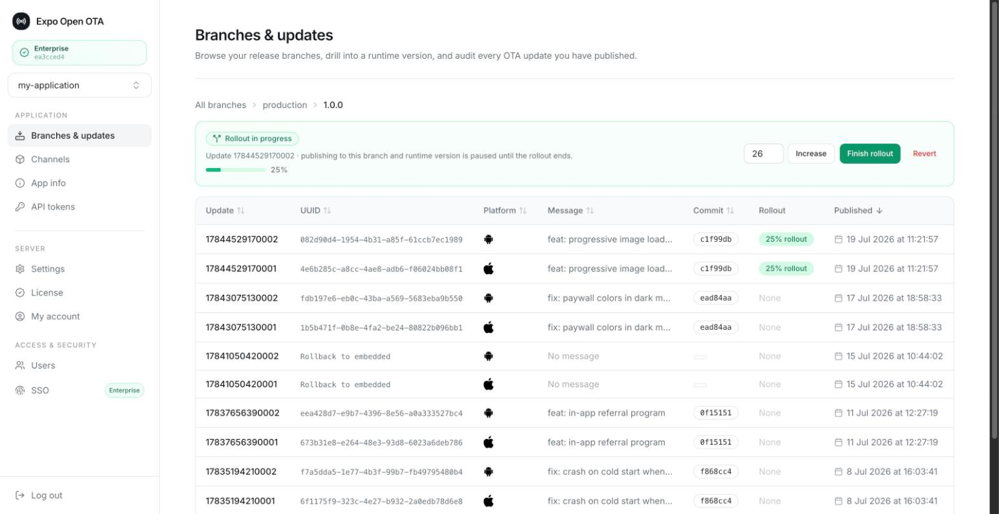
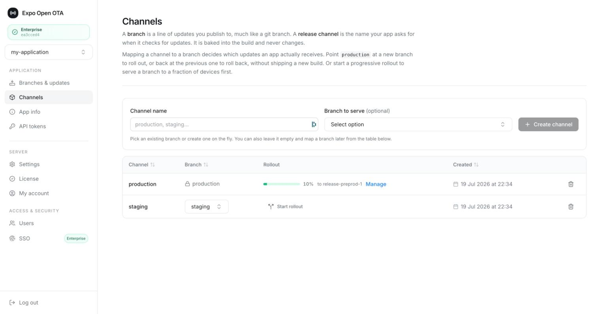
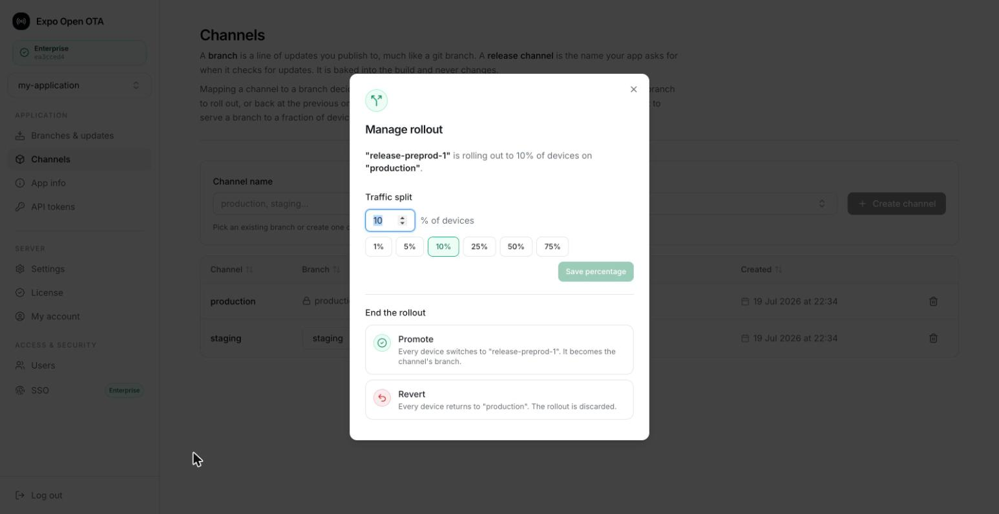
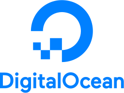
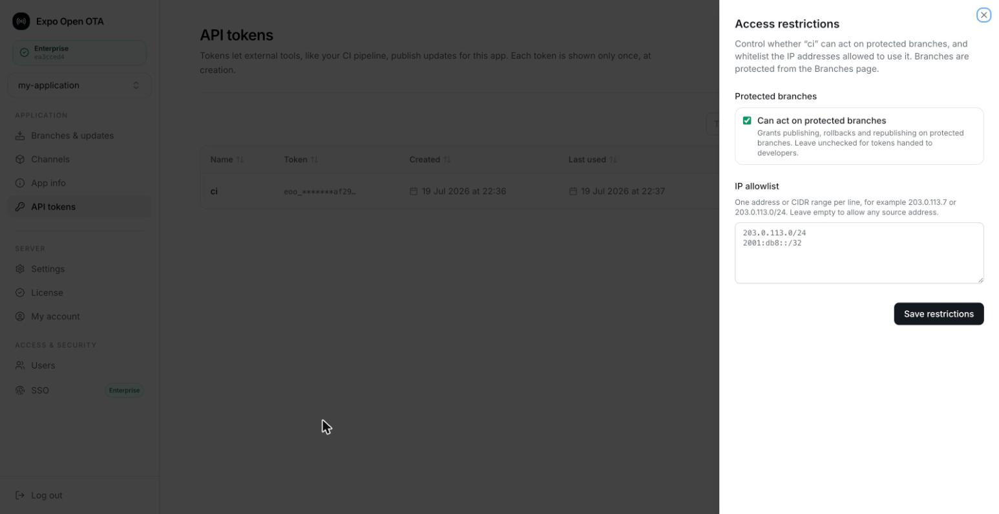
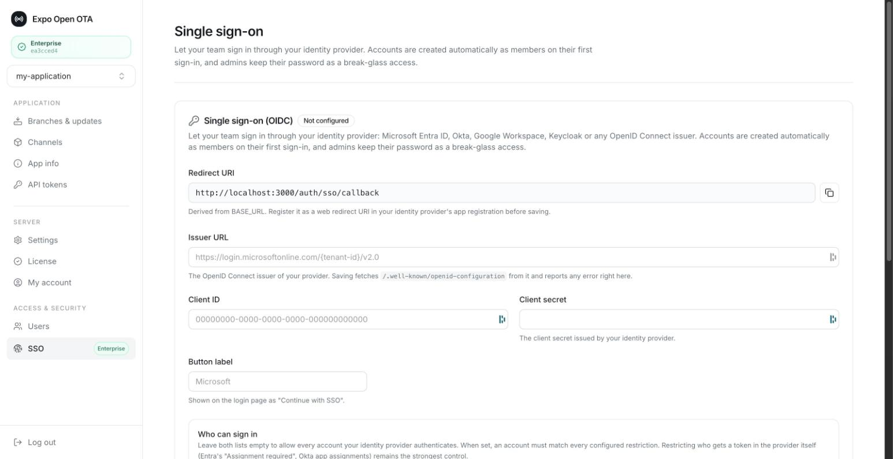

<p align="center">
  
</p>

<h3 align="center">Self-hosted over-the-air updates for Expo apps, built for production at scale.</h3>

<p align="center">
  An open-source Go server implementing the <a href="https://docs.expo.dev/technical-specs/expo-updates-1/">Expo Updates protocol</a>,<br/>
  with a web dashboard, multi-app support, progressive rollouts, instant rollbacks and one-command publishing.
</p>

<p align="center">
  <a href="https://github.com/mercuretechnologies/expo-open-ota/releases"></a>
  <a href="https://www.npmjs.com/package/eoas"></a>
  <a href="https://github.com/mercuretechnologies/expo-open-ota/actions"></a>
  <a href="./LICENSE.md"></a>
</p>

<p align="center">
  <a href="https://mercure-technologies.gitbook.io/expo-open-ota">Documentation</a> · <a href="#quick-start">Quick start</a> · <a href="https://github.com/mercuretechnologies/expo-open-ota/issues">Issues</a> · <a href="mailto:contact@mercuretechnologies.com">Contact</a>
</p>

<p align="center">
  <sub>Expo Open OTA is an independent open-source project. It is not affiliated with, endorsed or supported by <a href="https://expo.dev/">Expo</a>.</sub>
</p>

<p align="center">
  
</p>

> **Battle-tested in production.** Expo Open OTA has been serving over-the-air updates in production since early 2025, to apps totaling more than a million monthly active users.

## Why self-host your OTA updates?

**Cut costs.** EAS Update pricing scales with your monthly active users. Self-hosting serves unlimited updates to unlimited devices for the price of your infrastructure.

**Own your infrastructure.** Updates live in your bucket, are served by your server and travel through your CDN, behind your security policies.

**No vendor lock-in.** The standard Expo Updates protocol on top of standard storage. Switch clouds anytime.

## Built for production and scale

**Your CDN does the heavy lifting.** Devices download updates from your CDN, straight out of your bucket. The server only answers lightweight update checks, so millions of devices checking in never turn into millions of downloads hitting it.

**It scales horizontally.** The update server is stateless: run as many replicas as your traffic needs, they stay consistent with each other out of the box.

**It plugs into your monitoring.** Metrics, dashboards and health checks come built in, ready for whatever observability stack you already run.

## Features

### Multi-app support

One server hosts all your Expo apps. Each app gets its own branches, channels, API tokens and update history, and your whole team manages everything from a single dashboard. No Expo account required.

### One-command publishing

Ship an update from your terminal or CI with the [eoas](https://www.npmjs.com/package/eoas) CLI. Rollbacks and republishing are one command too.

```bash
npx eoas publish --branch production --rollout-percentage 10
```

### Release channels & branches

Your app is built once and asks for a channel. You decide which branch of updates that channel serves: remap to roll out, remap back to roll back. No rebuild, no store review.

<p align="center">
  
</p>

### Progressive rollouts

Ship to 10% of devices, watch your metrics, then increase, finish or revert in one click from the dashboard.

<p align="center">
  
</p>

### A/B testing

A channel can serve two branches at once, with devices split deterministically between them. Test two variants in production, promote the winner.

### Stateless mode

Start with nothing but a bucket and a few environment variables, no database. When you want the multi-app dashboard, plug in PostgreSQL and the server migrates itself into control plane mode automatically.

## Integrations

| | |
|---|---|
| **Storage** |  AWS S3 &nbsp;·&nbsp;  Google Cloud Storage &nbsp;·&nbsp;  Cloudflare R2 &nbsp;·&nbsp;  MinIO &nbsp;·&nbsp;  DigitalOcean Spaces &nbsp;·&nbsp; local file system |
| **CDN** |  CloudFront &nbsp;·&nbsp;  GCS signed URLs &nbsp;·&nbsp; direct serving |
| **Cache** |  Redis &nbsp;·&nbsp; in-memory |
| **Key store** |  AWS Secrets Manager &nbsp;·&nbsp; environment variables &nbsp;·&nbsp; local key files &nbsp;·&nbsp; sealed in the database |

Plus expo-updates code signing, and Hermes source maps for Sentry or PostHog.

## Quick start

[](https://railway.com/deploy/MGW3k1?referralCode=OEHlEK&utm_medium=integration&utm_source=template&utm_campaign=generic)

1. Deploy the server with the Railway button above, Docker or the Helm chart.
2. Run `npx eoas init` in your Expo project to wire it to your server.
3. Publish your first update with `npx eoas publish --branch production`.

The full walkthrough for both modes is in the documentation: [stateless mode](https://mercure-technologies.gitbook.io/expo-open-ota/stateless-mode/getting-started) and [control plane mode](https://mercure-technologies.gitbook.io/expo-open-ota/controle-plane-mode/getting-started). Coming from v2? Follow the [migration guide](https://mercure-technologies.gitbook.io/expo-open-ota/changelog-and-migrations/migrate-from-v2-to-v3).

## Enterprise

For teams that need tighter control, the [Enterprise edition](https://mercure-technologies.gitbook.io/expo-open-ota/open-core-and-licensing) adds:

- **Single sign-on (OIDC)**: let your team sign in through Microsoft Entra ID, Okta, Google Workspace, Keycloak or any OpenID Connect issuer.
- **Protected branches**: once a branch is protected, only API tokens you explicitly allow can publish, roll back or republish on it. A token handed to a developer for staging can never ship to production.
- **IP allowlists**: restrict each API token to your CI runners' addresses, per address or CIDR range.

<table>
  <tr>
    <td></td>
    <td></td>
  </tr>
</table>

The enterprise code lives in public `ee/` directories you can read before you buy, and licenses are verified fully offline against an embedded key: your production servers never phone home. Everything else on this page is MIT. For a license, [contact us](mailto:contact@mercuretechnologies.com).

## Contributing

Contributions are welcome! For anything beyond a small fix, please open an issue before writing code. Expo Open OTA is an open-core project and some advanced features are reserved for the commercial edition; the boundary is documented in [CONTRIBUTING.md](./CONTRIBUTING.md).

## Disclaimer

Expo Open OTA is **not officially supported or affiliated with [Expo](https://expo.dev/)**. This is an independent open-source project.

## License

The core is MIT and will stay MIT. Enterprise features live in `ee/` directories and are covered by a commercial license (see [ee/LICENSE](./ee/LICENSE)); everything else is MIT (see [LICENSE](./LICENSE.md)).

## Contact

[contact@mercuretechnologies.com](mailto:contact@mercuretechnologies.com)
