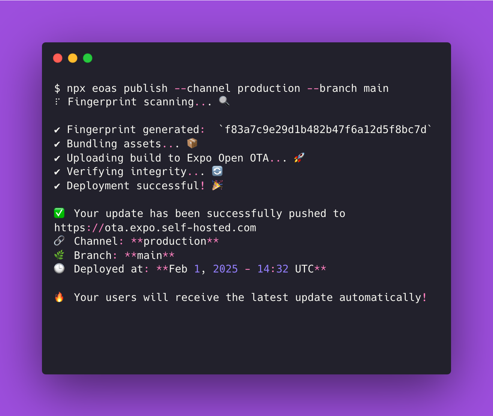
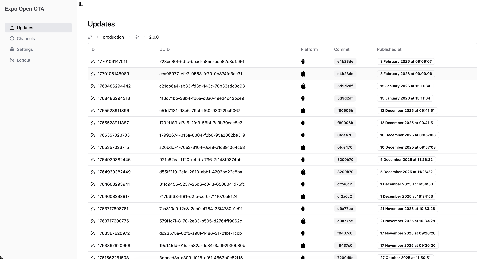

> [!IMPORTANT]
> ## 🚀 v3 is coming
> The next major version of Expo Open OTA is in release candidate. Key features:
> - **Control plane mode** — run the server on PostgreSQL, manage everything from the dashboard, no Expo account required
> - **Multi-app support** — host several Expo apps on a single server
> - **Per-app API keys** — publish from CI without sharing your Expo access token
> - **Secure key management** — signing keys sealed in the database with AES-GCM
> - **Per-app Prometheus metrics** and a redesigned dashboard
>
> 📖 Check out the **[new documentation](https://mercure-technologies.gitbook.io/expo-open-ota)**, including the [v2 → v3 migration guide](https://mercure-technologies.gitbook.io/expo-open-ota/migrate-from-v2-to-v3) — your installed clients will keep working without a rebuild.
>
> v2 remains the current stable release (`docker pull ghcr.io/axelmarciano/expo-open-ota:latest`, `npm i eoas`). Contributions: please target the `release/v3` branch.

  
  

<h3 align="center">Self-hosted OTA updates for Expo — multi-cloud, multi-app, production-ready.</h3>

  An open-source Go server implementing the <a href="https://docs.expo.dev/technical-specs/expo-updates-1/">Expo Updates protocol</a>. 
  Deploy on AWS, GCP, or locally.

  <a href="https://mercure-technologies.gitbook.io/expo-open-ota">Documentation</a> · <a href="https://github.com/axelmarciano/expo-open-ota/issues">Issues</a> · <a href="mailto:expoopenota@gmail.com">Contact</a>

---

## Why Expo Open OTA?

- **Cut costs** — Expo's OTA pricing scales with MAUs. Self-hosting gives you unlimited updates at infrastructure cost only.
- **Own your infrastructure** — Store updates on your cloud, behind your VPN, with your security policies.
- **No vendor lock-in** — Works with AWS, GCP, and any S3-compatible provider. Switch anytime.

## Two modes

| | Stateless mode | Control plane mode |
|---|---|---|
| **Apps per server** | One | Many |
| **Database** | None | PostgreSQL |
| **App management** | Environment variables | Dashboard UI + per-app API keys |
| **Expo account** | Required (channels & publishing rights) | Not required |

Start stateless, switch later: setting `DB_URL` migrates your app — keys, branches, and update history included — into the control plane automatically. See the [documentation](https://mercure-technologies.gitbook.io/expo-open-ota) for both modes.

## Features

| Feature | Description |
|---------|-------------|
| **Multi-app support** | Host several Expo apps on a single server with the control plane |
| **Multi-cloud storage** | AWS S3, Google Cloud Storage, S3-compatible (Cloudflare R2, MinIO, DigitalOcean Spaces), local file system |
| **Fast asset delivery** | CloudFront CDN, GCS signed URLs, or direct serving — your choice |
| **One-command publishing** | `npx eoas publish` from your CI/CD pipeline |
| **Secure key management** | AWS Secrets Manager, environment variables, local key files, or sealed in the database (AES-GCM) |
| **Dashboard** | Built-in web UI for managing apps, updates, branches, and runtime versions |
| **Prometheus metrics** | Production observability out of the box, per-app labels included |
| **Stateless mode** | Run without any database — zero external dependencies beyond your storage provider |
| **Helm chart** | Ready for Kubernetes deployments |

## Quick Start

And follow the [Getting Started guide](https://mercure-technologies.gitbook.io/expo-open-ota/stateless-mode/getting-started) to get up and running in minutes.

## Migrating from v2?

v3 changes the bucket layout (updates are now scoped per app id) and identifies apps by the `expo-app-id` header. Your installed clients keep working without a rebuild — follow the [v2 → v3 migration guide](https://mercure-technologies.gitbook.io/expo-open-ota/migrate-from-v2-to-v3).

## Storage Options

| Provider | Mode | Asset Delivery |
|----------|------|----------------|
| **Amazon S3** | `STORAGE_MODE=s3` | Direct or CloudFront CDN |
| **Google Cloud Storage** | `STORAGE_MODE=gcs` | GCS signed URLs |
| **S3-compatible** (R2, MinIO, etc.) | `STORAGE_MODE=s3` + `AWS_BASE_ENDPOINT` | Direct |
| **Local file system** | `STORAGE_MODE=local` | Direct (dev only) |

## Disclaimer

Expo Open OTA is **not officially supported or affiliated with [Expo](https://expo.dev/)**. This is an independent open-source project.

## License

Core is MIT and will stay MIT; advanced org features may be offered under a commercial license in the future
see [LICENSE](./LICENSE.md).

## Contact

[expoopenota@gmail.com](mailto:expoopenota@gmail.com)
